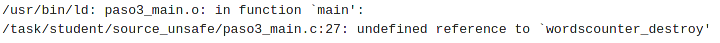

# TP0 - Contador de Palabras

Pablo Salvador Dimartino - 101231

Taller de Programación I (75.42)

Facultad de Ingeniería

Universidad de Buenos Aires

[Link al repositorio de GitHub](https://github.com/psdimartino/TallerDeProgramacion_TP0)

## Paso 0: Entorno de Trabajo


a. 

b. Valgrind es un conjunto de herramientas orientadas al análisis dinamico de programas. Es decir, se centran en la búsqueda de bugs a traves de la ejecución del código. 
Su herramienta principal es _Memcheck_. Dicha herramienta permite obtener la informacion sobre los accesos de un programa a la lectura y escritura en memoria.

c. El `sizeof()` es un operador estándar de C y C++. Dicho operador permite obtener el tamaño de un tipo de dato, ya sea primitivo o *structs*. El valor de retorno corresponde a su tamaño en bytes. El valor de `sizeof(int)​` depende de la plataforma en la que se ejecuta el programa. En mi entorno este valor corresponde a 4 bytes. El valor de `sizeof(char)​` es siempre 1 byte, independientemente de la arquitectura.

d. El tamaño de un *struct* puede ser igual o mayor a la suma del tamaño de todos sus elementos. Este fenómeno se debe al _padding_ que se realiza en la memoria para guardar los distintos tipos de datos. Por ejemplo:

    ```c
        struct Persona {
            int edad;
        };

        struct Persona {
            int edad;
            char letraFavorita;
        };
    ```
    El tamaño de la primera estructura corresponderá a la suma de sus partes, un entero. El tamaño de la segunda estructura, dependiendo de la arquitectura, puede no ser igual a la suma de sus partes. En particular, en mi entorno de trabajo, dicho tamaño es de 8 bytes. Esto correponde a 4 bytes por el entero, 1 byte por el caracter y 3 bytes no utilizados provocados por el alineamiento de la memoria realizado por el _padding_.

e. Los tres archivos estandar *STDIN*, *STDOUT* y *STDERR* son 3 archivos que se abren al comienzo de la ejecucion del programa. Por convención se utilizan para la lectura de datos de entrada, la escritura de la salida principal de datos y la escritura de de datos para el informe de los errores.

    Dichos streams pueden ser redireccionados mediante los operadores "<", ">" y "|". 

    Los comandos "<" y ">" se utilizan para direccionar un archivo de texto como entrada y salida estandar, respectivamente:

    ```
        ./programa < entrada > salida
    ```

    El operador "|" permite redireccionar los streams entre programas:

    ```
        ./programa_de_salida | programa_de_entrada
    ```

    es importante notar que este redireccionamiento es en paralelo. El segundo programa puede leer el stream al mismo tiempo que el primero lo emite.

# Paso 1: SERCOM - Errores de generación y normas de programación

a. Captura de los errores de estilo

    

    * ***paso1_wordscounter.c:27:*** Falta un espacio entre el while y la apertura del paréntesis
    * **paso1_wordscounter.c:41:** Hay mas espacios de un lado de la condición del if que del otro
    * **paso1_wordscounter.c:41** Similar al error anterior, la condición del *if* debería tener uno o ningún espacio
    * **paso1_wordscounter.c:47:** Un *else* debe estar en la misma linea que el cierre de llaves del *if* anterior
    * **paso1_wordscounter.c:47, paso1_main.c:15: **Un *else* no deberia tener una sola llave en su misma linea
    * **paso1_wordscounter.c:48:** No se seapro el *if* de su condicion con un espacio
    * **paso1_wordscounter.c:53:** No deberia separarse un punto y coma con un espacio. Explica tambien como deberia actuarse en una situacion que no corresponde al error,
    * **paso1_wordscounter.h:5:** No se deberian superar los 80 caracteres en una misma linea
    * **paso1_main.c:12:** `strcpy()` puede provocar un *buffer overrrun* si el *string* a escribir es demasiado grande y es insegura. `snprintf()` garantiza que esto no suceda y es una funcion mas segura. Esto no es un error de estilo, sino un problema de seguridad.


b. Captura de los errores de compilación

    

    Los errores en esta sección son por problemas en el linker: Al no inlcuir los arhivos paso1_wordscounter.h y paso1_wordscounter.c las declaraciones de las funciones en estos archivos no son tomadas en cuenta y crea los errores de declaracion implicita.

c. Los errores en las lineas 23, 24, 25 y 27 son producidos por el _warning_ `Wimplicit-function-declaration`. `-Wall` indica al compilador utilizar todo el set de _Warnings_. El flag `-Werror` trata todos los _Warnings_ como error.

# Paso 2: SERCOM - Errores de generación 2

a. Modificaciones con respecto a la versión anterior:

    * **main.c:** Se incluyó el archivo paso2_wordscounter.h para evitar los errores del linker del paso anterior.
    Luego se reemplazó la funcion `strcpy()` por `memcpy()` indicandole el largo del string de entrada. Finalmente se arregló el error de estilo en el else, posicionando las llaves de forma correcta. 

    * **wordscounter.c:** Se incluyó el archivo paso2_wordscounter.h para evitar los errores del linker del paso anterior. Se arreglaron los errores de estilo en las lineas 13, 26, 40, 46, 47, 48 y 53

    * **wordscounter.h:** Se mejoró el comentario en la linea 5.

b. Captura de la correcta ejecucion de la verificacion de errores de estilo

    

c. Captura de los errores de compilación

    

    * **paso2_wordscounter.h:7:5, paso2_wordscounter.h:20:1:** No se incluyó a la biblioteca *<stddef.h>* y *size_t* no se encuentra definido. Es un error del linker. La nota en paso2_wordscounter.h:1:1 indica este error.

    * **paso2_wordscounter.h:25:49, paso2_wordscounter.h:1:1:** No se incluyó a la biblioteca *<stdio.h>* entonces *FILE* no se encuetra definido. Es un error del linker.

    * **paso2_wordscounter.c:17:8:** error: Existen definiciones de la funcion wordscounter_get_words de forma conflictiva. Como solo sucede en dicha funcion, la cual su retorno es tipo *size_t*, parece ser un error de linker. Si se define de forma implicita a una función, se asume que tiene un valor de retorno tipo int. Esto es conflictivo con el tipo size_t.

    * **paso2_wordscounter.c:30:25, paso2_wordscounter.c:30:25:** No se incluyó a la biblioteca *<stdlib.h>* entonces la funcion `malloc()` no se encuetra definida. Es un error del linker.

# Paso 3: SERCOM - Errores de generación 3

a. Modificaciones con respecto a la versión anterior:

    * **wordscounter.c:** Se incluyo a la libreria stdlib.h para definir a la funcion `malloc()`.

    * **wordscounter.h:** Se incluyeron las librerias *<string.h>* y *<stdio.h>* para definir *size_t* y *FILE*.

b. Captura de los errores de compilación

    

    * **paso3_main.c:27:** Se declaró pero no se definió `wordscounter_destroy()`. Error del linker.

# Paso 4: SERCOM - ​Memory Leaks ​y ​Buffer Overflows

a. Modificaciones con respecto a la versión anterior:

    * **wordscounter.c:** Se definio la funcion `wordscounter_destroy()`, la cual hace nada. Eso soluciona el problema del paso anterior.

b. Captura de pantalla de la ejecucón con Valgrind del test TDA

    

    * **paso4_main.c:14:** Se abre un archivo con fopen() pero nunca se lo cierra.
    * **paso4_main.c:24 -> paso4_wordscounter.c:30 -> paso4_wordscounter.c:35:** Se hace un `malloc()` de tamaño 7 chars pero no se los libera antes del cierre del programa.

c. Captura de pantalla de la ejecución con Valgrind del test long filename

    

    * **paso4_main.c:13:** Hubo un *buffer overflow* al leer con memcpy un argumento del programa. Esto sucedió posiblemente porque, al *string* ser muy largo, superar los 30 caracteres del destino de la copia.

d. Utilizar `strncpy()` no solucionaría el problema. Dicha funcion, aunque se la puede limitar al tamaño del string destino, no coloca un caracter *NULL* al final del string si el tamaño del string de origen es mayor a la limitación  de copia establecida. Dado el origen del problema, este persistiría. *Un string* suficientemente largo podría superar el tamaño del *string* de destino.

    Al leer el *string* filepath sin caracter de fin se genera un *segmentation fault* ya que el programa continua leyendo mas alla de la memoria asignada para el sting nombrado.

e. Un **segmentation fault** o violacion de acceso sucede cuando se accede a memoria a la cual no se estaba autorizado o no se fue asignada por el sistema operativo para la ejecucion de un programa.

    Un **Buffer overflow** o desbordamiento de búffer es un estado de error de un programa que indica que se exedieron los limites de un búffer de datos al intentar escribir sobre este.

# Paso 5: SERCOM - Código de retorno y salida estándar
a. Modificaciones con respecto a la versión anterior:

    * **main.c:** Se utiliza *argv[]* directamente como parámetro de nombre de archivo en `fopen()` en vez de utilizar `memcpy()` para copiar el string. Tambien se verifica que el input sea distinto a *stdin* y se cierra el mismo en caso de que esto sea cierto.

    * **wordscounter.c:** En vez de gernerar un string con memoria dinamica, se genera uno con memoria estática para los caracteres delimitadores evitando la llamada a `malloc()`.

b. Ambas pruebas fallan por una diferencia entre la salida esperada y la real. SERCOM indica que ambas pruebas contaron mal las palabras. 

    En archivo_invalido se esperaba 1 y el resultado fue 255

    

    En una_palabra se esperaba 1 y el resultado fue 0.

    

c. El último caracter del archivo es 'd', correspondiente a ASCII 100 (64 en base hexadecimal)

    

d. El debugger no se detuvo en la linea 45 porque en ningun momento entra en el estado "STATE_IN_WORD" al recorrer el ciclo. Lee el caracter EOF, cambia su estado terminación de progama y finaliza. Nunca, para este caso, recorre esa linea.

    Los comandos del gdb utilizados son:

    * **info functions:** Muestra todas las funciones definidas dentro del programa
    * **list:** Permite imprimir las lineas de codigo que se requieran
    * **break:** Inserta un breakpoint en la linea indicada
    * **run:** Corre el programa dentro del debugger
    * **quit:** Termina la ejecución de gdb 

    

# Paso 6: SERCOM - Entrega exitosa

a. Modificaciones con respecto a la versión anterior:

    * **main.c:** Se definió el valor de retorno de error del programa a 1. Esto corresponde con el valor indicado en el enunciado.
    * **wordscounter.c:** Se modificó donde se declaran los caracteres delimitadores. También se modificó el +if-case+ del ciclo, reparando el bug del paso anterior. El programa ahora cuenta cuando se esta en una palabra (STAE_IN_WORD) y se llega al caracter *EOF*, pero no lo hace si se esta en un caracter delimitador (STATE_WAITING_WORD) y se acaba el archivo.

b. Capturas de las entregas realizadas

    
    

c. Capturas de ejecucion de la prueba "Single Word"

    